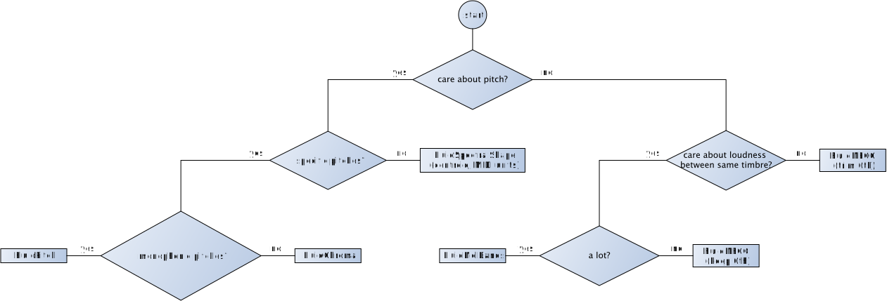

# Getting Orientated in FluCoMa 

Once you have FluCoMa installed, you should see the `Fluid Corpus Manipulation Toolkit` entry in the extras menu. If you open that up, you'll see that we've categorised the various objects in FluCoMa

* **slice audio**: Different ways of chopping up signals 
* **analyse audio**: A suite of audio descriptors, many of which you may be familiar with already 
* **decompose audio**: Objects for breaking a signal up into components based on different modelling assumptions 
* **transform audio**: Objects that combine or process signals 
* **analyse data**: The set of objects for finding patterns and organising corpuses using a range of machine learning algorithms 
* **helpers**: a grab bag of abstractions and externals to help with the process of building and managing a corpus

Clicking on object names gives you a digest for that object, and buttons that will open the help file and reference page (which *almost all* things have). 

Also in the extras menu should be the `FluComa Conventions` entry, which is a patch from the repo for this workshop that describes some of the common ways FluCoMa objects behave, and should hopefully be a useful reference. 

# Slicing, Analysing, Describing 

To jump in and look at the first categories of objects for slicing, analysing and decomposing audio, open up `patchers/monday/descriptors_control.maxpat`

This starter patch is a little multi-tap filtered feedback delay, partially controlled by a slicer (`fluid.onsetslice~`) and a spectral centroid descriptor (from `fluid.spectralshape~`). We show some basic possibilities for using descriptors as control signals – which is a paradigm you've all possibly explored already – and some basic ideas for how such signals can be manipulated or transformed to squeeze extra juice out of them. 
 
**Because this patch involves feedback and resonant filtering, please keep your volume low whilst exploring. We've tried to make very sure it won't ever howl / blow up, but better safe than sorry...**

Have a play with it, and start experimenting. What happens with: 
* different onset threshsolds
* different settings for 'colour'
* different onsetslice~ metrics? (thresholds will vary widely)
* different spectral features? 
* different slicer? 
* different / more features? 
* different conditioning approaches

How do things sound if we *decompose* our input, and just use one component to send to the delay? Try with `fluid.hpss~`. What happens if the feature detectors are also just fed from a single component? 

# Entering `buffer~` world

## Analysing `buffer~`s and getting batchy 

If you've worked with descriptors in Max before, then the paradigm of *online* analysis in the `descriptrors_control` patch is probably what is most familiar to you. 

However, it's not the most convenient when trying to analyse larger bundles of sounds in batch as part of building a corpus for composing with (although we will see this afternoon an approach to building a corpus on the fly using online analysers). For this reason, all the objects you've met so far have `buffer~`-based counterparts, as you probably noticed in the overview patch. These make processes of batch analysis and fine control simpler and more robust, but might present a less familiar way of working. 

Look at `patchers/monday/buffers_prelims.maxpat`. This sets out what seem like the prime things not to forget about working with `buffer~`s for corpus building in FluCoMa, i.e. 
1. How multichannel features and multichannel sources are handled 
2. The effective sampling rate of descriptor outputs (i.e. each sample of the buffer is an analysis-hop's worth of source samples)
3. How to select just a portion of a source to analyse
4. `fluid.bufcompose~` is your friend (but kind of low level)

Let's do stuff. Open`patchers/monday/buffers_hackme.maxpat`

(If you don't have your own sounds, then the FluCoMa demo sounds, or C74 stock sounds are at hand)

1. Experiment with some different features for your sounds, and see if you can get a handle on what seems to make sense. 

  * Does it help to look at the feature curves? 
  * Is there a single feature that seems to make sense for your sounds (and what you find interesting / unifying in them?). 
  * If it seems like there isn't, do you have an intuition as to why? 
  
PA's if-I-only-had-one-feature flowchart might be a useful / playful place to start 

2. Move on to experimenting with `fluid.bufcompose~` and `polybuffer~` and try and get a feeling for what a batch workflow might feel like. 
  * We have some helper abstractions for doing batch analyses, but their value and operation is probably clearer once you understand what they're doing and why. Also, they embody only one of many possible workflows...
  
  
  
  
