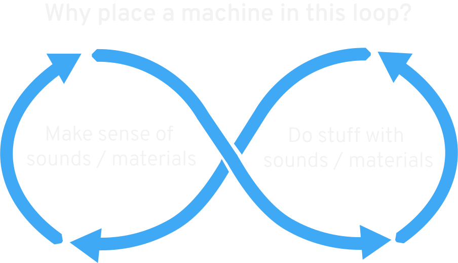

# Hello!

Many thanks for taking part in this workshop! This is the first FluCoMa workshop in what will be (we hope) a busy year of spreading the good word and helping people get fluid with their corpuses. 

# The General Sketch 

We understand that folk are going to need to dip in and out, as life continues on around us. So we've tried to build some flexibility in. Each day runs notionally 1000-1600

Today and tomorrow (Mon, Tues) are front-loaded with more didactic (but hands-on) material, as we orientate ourselves and map out the general Ways of FluCoMa. We then segue into a more open-ended mode, with Wednesday given over to some collective hacking on a set of small projects we'll devise together at the end of Tuesday. Thursday is given over to helping you figure out / make progress on the part FluCoMa could play in your own project(s) / practice. Friday we've left hazy, but could be filled with whatever seems to tickle the group (we could talk about our own projects; look at the SuperCollider version; explore the C++; build something ambitious; have a jam...)

So, it looks something like this. Timings are notional. Everything is negotiable. The idea is to cover lots quickly today, and go deeper tomorrow, and then deeper still before coming up for air on Thursday.

| |Mon|Tue|Wed|Thurs|Fri|
|---|---|---|---|---|---|
|1000-1100|Welcome|Review|Hack|Personal project support|TBD|
|1100-1200|Analyse, Decompose, Transform|MLP regressor|Hack|Personal project support
|1200-1300|DataSet and friends|MLP regressor|Hack|Personal project support
|1400-1500|Quick MLP classifier|Dimension Reduction|Hack|Personal project support
|1500-1600|Quick nearest neighbour|Devising hack projects|Hack|Personal project support

# Feedback 
Please, yes. Lots. However you feel most comfortable delivering it. If you don't get what we're saying, please feel welcome to stop us and say. If you have suggestions for improvements to materials, or the toolkit, likewise (and / or submit issues on GitHub). If you'd rather do it in private, then you can e-mail us. 

# FluCoMa: What, Why etc. 

FluCoMa is a project funded for five years by the European Research Council, under the stewardship of PA. Despite appearances, it's not a project *about* machine learning, but rather about how technologies like machine learning / listening, data mining might extend, disrupt, enhance musical and sonic practices that make use of collections of recorded sound (corpuses, in the broadest sense). This might be library orientated sound design; or studio-based composition practice; or improvisation with autonomous software; or generative sound art; or computer aided orchestration; or, or, or...You get the idea, we hope.  

Something that's core to the project is that we want the work we do to animate and enable more creative coding research and practice, and that we want to do this on as pluralistic basis as possible. This presents the (quixotic) challenge of trying to balance flexibility, accessibility, efficiency, extensibility, and so on., and avoid baking-in our aesthetic preferences. (so, about that feedback...)

This is like the most general possible model of musicking we could devise, but it captures something important, which is the iterative and practical basis of composing / designing / playing. i.e. making-sense involves doing, which involves making-sense etc etc. 

So why stick a machine listening / learning thing into this complex, embodied loop? We think there's lots of reasons why this could be fun / interesting / provocative / etc., and you all probably have your own. So, by way of getting acquainted, let's share them...
